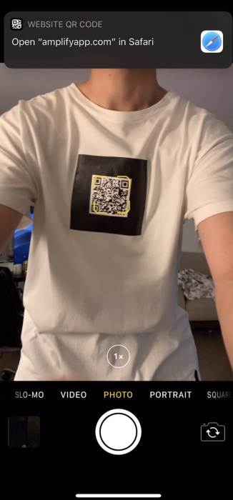
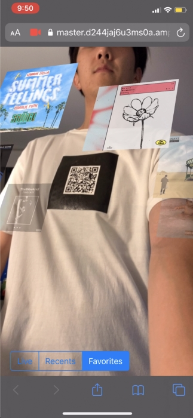

## Demo
### Scan QR code with Camera app

### Request camera permission for web browser

### Point camera at AR marker (the QR code is the marker)
Make sure that the marker is flat, and the lighting is not too bright. Works best when marker is less than 6 ft away.

### Once marker is detected, currently playing song appears
If the wearer has not authorized public permission to view their music, the viewer will see an error.

### Swipe to play next song in the queue
The viewer has control to play the next song!

### View a carousel of wearer's favorite songs
Besides seeing the wearer's currently playing song, the viewer can also see their current favorites.

